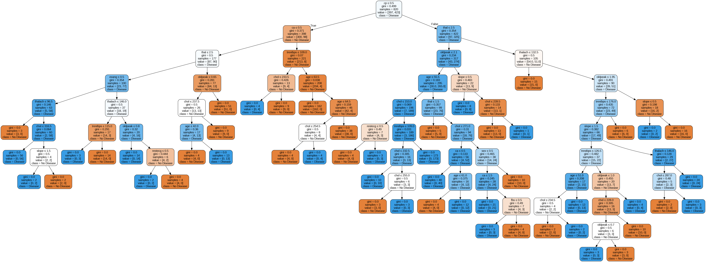
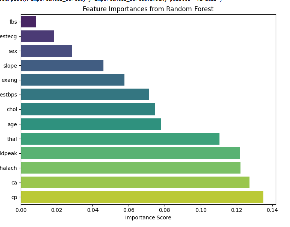

## 🌳 Task 5: Decision Trees and Random Forests

### 📝 Objective
Build and evaluate Decision Tree and Random Forest models for classifying heart disease using the `heart.csv` dataset.

---

### 🛠️ Tools & Libraries
- **Scikit-learn** – for ML models, evaluation, and cross-validation  
- **Graphviz** – for decision tree visualization  
- **Matplotlib & Seaborn** – for plotting feature importances  
- **Pandas & NumPy** – for data manipulation  

---

### 📊 Dataset
- **File**: `heart.csv`  
- **Target Column**: `target` (1 = Disease, 0 = No Disease)  
- **Features**:  
  `age`, `sex`, `cp`, `trestbps`, `chol`, `fbs`, `restecg`,  
  `thalach`, `exang`, `oldpeak`, `slope`, `ca`, `thal`

---

### 🔧 Key Steps
1. Train a **Decision Tree** and visualize it using Graphviz.  
2. Prune the tree (`max_depth=3`) and check for overfitting.  
3. Train a **Random Forest** and compare its accuracy.  
4. Visualize **feature importances** using a bar chart.  
5. Evaluate both models using **5-fold cross-validation**.

---

### 📸 Outputs

#### ✅ Decision Tree Visualization

#### ✅ Feature Importance from Random Forest

